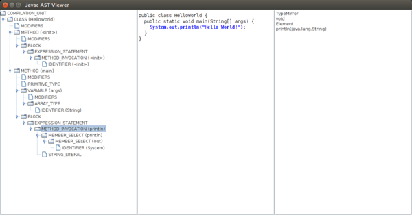

# JAST: Javac AST Viewer.

A simple tool to visualize the AST generated by Javac.

## Compiling and running.
Assuming that you are in the src directory of this repo.

### Java 8.
```
javac -cp <path-to-jdk8>/lib/tools.jar *.java
java -cp .:<path-to-jdk8>/lib/tools.jar JavacASTViewer <path-to-java-file>
```

### Java 9+.
```
javac *.java
java -cp . JavacASTViewer <path-to-java-file>
```

## Sample output.

This image shows the output when providing as input a Hello World program.
The left panel shows the tree. When a node is selected, the center panel
highlights the corresponding section of the source code. The right panel
display additional data.

